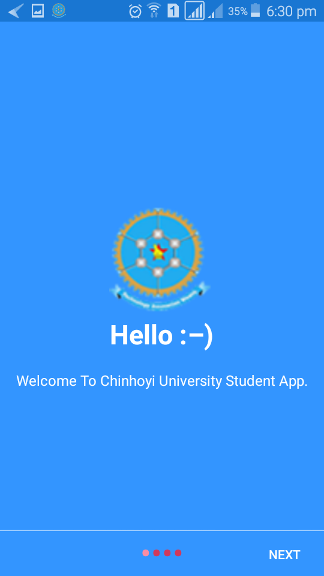

# Android-CutStudenApp
This is a Chinhoyi University of Technology (CUT) Student Android Application 
This is primary a timetable application that seeks to assist students in their studies.
The app time is made up of tabs using view pager.
This repository seeks to help those who want to understand the how it was developed and who wants to better the app it self .

basic gradle information: min-sdk 14  and the max-sdk at the moment of developing this app was 25.0.0

you will need internet when importing this project in android studio as there are several dependences used.

Good luck feel free to fork or make an issue for this or contact me for further understanding of the code it self. 

-----------------Start of Advanced Read Me ---------------------------------

This is a bit more detailed section so this you may not find it very necessary .

The app in the code section you may find that there are modules that have not been used or called in some  sections.
As i was making the app originally the app was meant to an extension to the Official set of CUT apps family ,but when i got back from my attachment to have this app implemented i have met several complications as i had showed the app to the school department.I could no longer make time to meet the many required expectations  for the app as i could not make more time because of my studies.

The app ability to make server download have been removed but the code is there.
The Server Admin section has been eliminated .

download link to apk debug version:http://zimcybers.co.zw/CUT-Student-debug.apk

-----------------End of Advanced Read Me ---------------------------------

screenshots:

